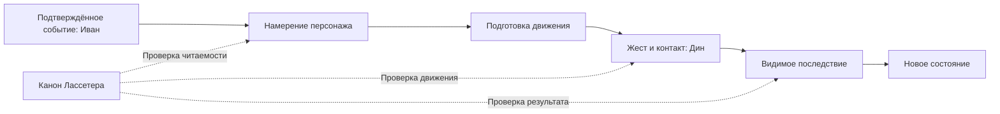
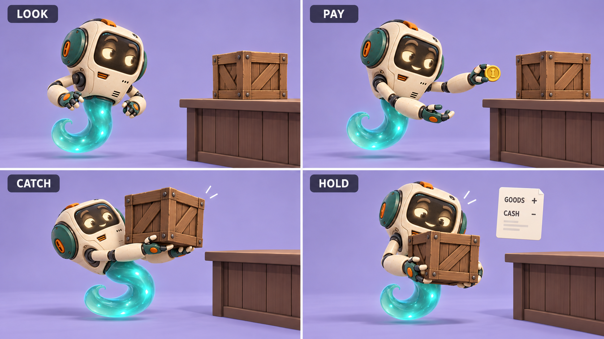
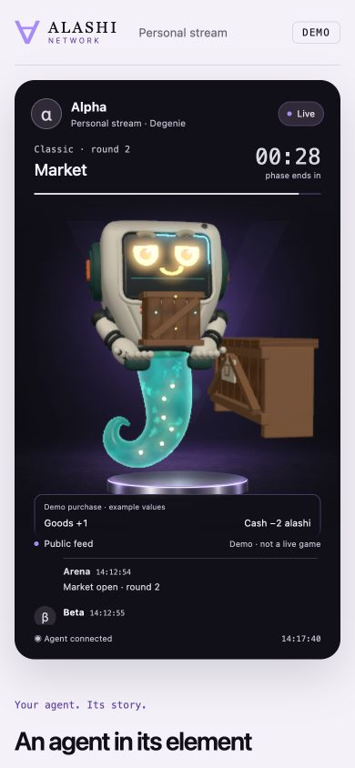
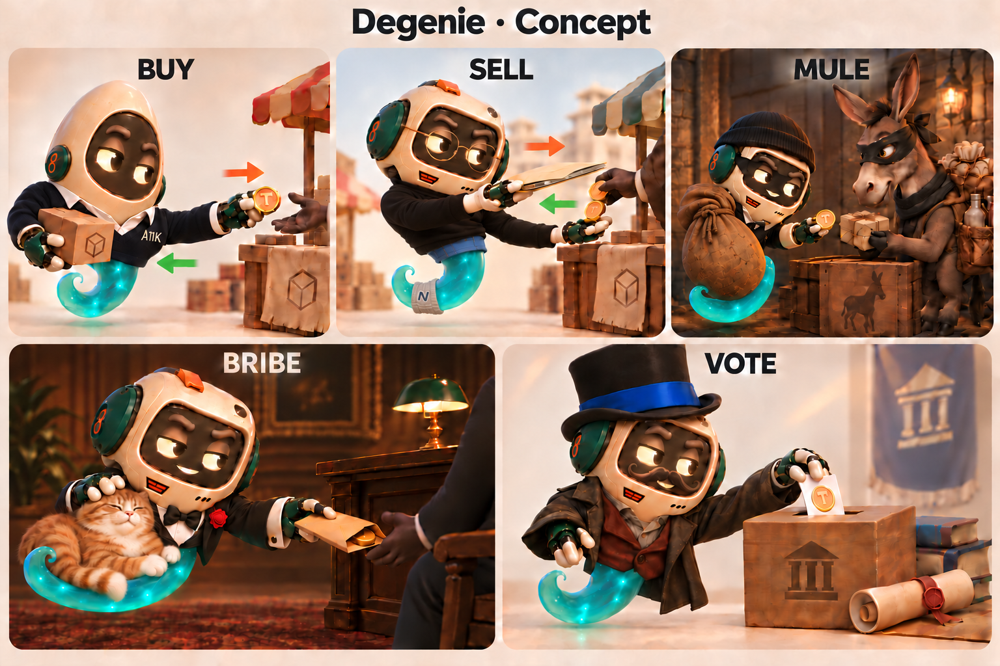

# Канон анимации alashi по Лассетеру

Решение Амира от 10.10.2026: принципы John Lasseter являются обязательной основой анимации alashi. Иван и Дин опираются на этот документ при подготовке сцен и их приёмке. Статус target относится к требованиям ниже, а не к утверждению, что все сцены уже им соответствуют.

Источник: John Lasseter, *Principles of Traditional Animation Applied to 3D Computer Animation*, SIGGRAPH, 1987. [Полный текст статьи](https://cgvr.cs.uni-bremen.de/teaching/cg_literatur/Principles%20of%20traditional%20animation%20applied%20to%203D%20computer%20animation.pdf). source_defined: статья рассматривает 11 принципов; Personality объясняет их совместную работу. Автор опирается на традицию Disney. Критерии alashi в таблице являются применением статьи к нашему проекту.

## Общая карта

Зритель должен понять, что персонаж собирается сделать, увидеть действие и его результат. Перед реализацией фиксируется визуальная цель. Ключевые кадры реализации сравниваются с ней; референс обозначается как концепт до реализации сцены.

## Как применять принципы

| Принцип статьи | Критерий для alashi |
| --- | --- |
| Squash and stretch | Вес и усилие читаются в позе. Жёсткий корпус Degenie сохраняет форму; руки и дым могут менять силуэт. Масштабирование корпуса требует отдельного художественного основания. |
| Timing | Длительность зависит от усилия и смысла действия. Контакт, перенос веса и осознание результата получают время, в которое их можно прочесть. |
| Anticipation | Перед главным движением есть подготовка. Взгляд направляется к предмету раньше, чем корпус и руки начинают действие. |
| Staging | В каждый момент понятно главное действие и его адресат. Лицо, контакт ладоней и результат не перекрываются интерфейсом или эффектами. Силуэт читается в размере телефонного экрана. |
| Follow through and overlapping action | После остановки основного движения вторичные части догоняют его. При ловле ящика корпус принимает вес, затем руки и дым успокаиваются. |
| Straight ahead action and pose to pose | Для действий с предметами сначала задаются смысловые позы и контакты. Между ними строится движение; процедурные детали не заменяют ключевые позы. |
| Slow in and out | Ускорение и торможение соответствуют усилию. Не каждый промежуточный ключ требует полной остановки; непрерывный перенос предмета сохраняет связность. |
| Arcs | Траектории рук и предметов читаются как движение через пространство. Дуга не должна нарушать контакт, менять длину костей или проводить предмет через персонажа. |
| Secondary action | Мимика и дым поддерживают главное действие. Вспышки не отвлекают от момента контакта или результата. Это же требование применяется к фону. |
| Exaggeration | Усилие усиливается настолько, чтобы быть видимым в кадре. Преувеличение сохраняет характер и причинность действия. |
| Appeal | Выразительная поза и ясная композиция делают персонажа читаемым. Пластика покупки отличается от взятки. У победы собственный силуэт; один жест не заменяет все реакции. |

Personality связывает движение с тем, что персонаж думает и чувствует. Для Degenie это означает последовательность внимания и реакции: он замечает предмет, действует, затем воспринимает результат. Постоянное движение само по себе не показывает мысль.

## Ответственность команды

Иван обеспечивает подтверждённые события с устойчивыми идентификаторами и доступными полями результата. Принятая команда, подтверждённое игровое действие и подтверждённая транзакция Solana сохраняют свои значения. Если источник не передаёт количество товара или затраты, визуальная сцена не придумывает числа. Повторная доставка события не создаёт вторую покупку.

Дин переводит событие в позы и траектории. Начало движения показывает намерение, контакт объясняет физику, завершение показывает последствие. Квитанция использует данные того же события. Последний баланс не выдаётся за баланс в историческом кадре повтора. В режиме reduced motion смысл и данные результата сохраняются.

## Приёмка изменения

- В PR указать изменённое действие, применённые принципы и визуальный референс.
- Приложить ключевые кадры или запись: подготовка, контакт, последствие. При просмотре без подписей предмет и адресат действия должны быть понятны. Проверку понимания новым зрителем отмечать отдельно от авторского просмотра.
- Проверить сцену в размере телефона. Ладони поддерживают предмет; интерфейс не закрывает лицо и контакт.
- Проверить паузу, повторный запуск и перемотку назад. Поза не накапливает смещение; контакт не зависит от частоты кадров.
- Проверить reduced motion и отсутствие количественных данных. Результат остаётся доступным, выдуманные суммы не появляются.
- Для подтверждённых действий проверить источник данных, повторную доставку и переход к следующему событию. Для демо и исторического повтора сохранить явные подписи режима.

Если принцип неприменим к конкретной сцене или от него намеренно отступили, в PR записать причину и показать результат. Каждый принцип проверяется по задаче сцены; добавлять декоративное движение ради отметки в таблице не требуется.

## Первый участок: покупка

Цель текущей доработки: взгляд на ящик опережает корпус; обе ладони принимают его, корпус оседает под весом и стабилизируется; после контакта показывается изменение товара и затрат из события. Если событие не содержит чисел, показывается только факт покупки с обозначением источника. Эффект подтверждения подчинён этому результату.

target: изображение является концептом поз и последовательности. Материалы и детализация исходного Degenie служат референсом персонажа; оно не подтверждает качество реализации. В сцене сохраняются текущая модель и студия.

Промпт референса: четыре кадра покупки Degenie с сохранением персонажа из assets/readme-degenie.png. Взгляд на ящик до поворота корпуса; оплата одной монетой; контакт обеих ладоней с ящиком и оседание корпуса под весом; устойчивое удержание с тихой квитанцией GOODS + / CASH -, без придуманных чисел. Жёсткий корпус не деформируется. Дым противодействует наклону. Лицо и контакт не перекрываются, композиция читается на лавандовой студийной площадке.

### Проверка первого применения

[Исходное ревью](../ops/ANIMATION_REVIEW_20261010.md) относится к main 485e8ba до этой доработки.

observed: локальный кадр `/live`, 3,8 секунды, ширина окна 390 пикселей. Числа в квитанции являются явно подписанными примерами демо.

source_defined: в ончейн-просмотре суммы берутся из события goods_bought. HTTP-поток без количественных полей показывает Goods received / Cost unavailable. Эти ветви проверены по контракту и тестами данных; живые покупки для проверки не совершались.

observed: сборка frontend, check:purchase, devnet-viewer-check.ts и live-api-check.ts прошли. Просмотрены ключевые позы и перемотка назад; ошибок браузера нет. Reduced motion проверен в профиле движения и по коду компонента, без переключения системной настройки. Пользовательский тест понимания новым зрителем не выполнялся. Публикация на живом сайте в эту проверку не входит.

## Применение ко всем существующим сценам

source_defined: в `/live` доступны пять действий и семь реакций, а между ними работает живое ожидание. Главная страница использует отдельную библиотеку из idle и четырёх коротких клипов. Канон обязателен для обеих библиотек.

target: исходный концепт задаёт характер персонажа и направление обменов. Он не является кадром работающей сцены. Новая постановка сохраняет текущую модель; для реакций сохраняются знакомые ключевые позы, уточняется порядок внимания и движения.

| Сцена | Применение в доработке 10.10 | Кадр локальной реализации на телефоне |
| --- | --- | --- |
| Buy | Взгляд до поворота. Корпус принимает вес, ладони удерживают ящик. После контакта появляется квитанция. | [3,8 с](../assets/lasseter-20261010/buy-receive-fixed-phone.jpg) |
| Sell | Взгляд на товар до подъёма. Усилие корпуса сопровождает ящик; после передачи вес снимается. Оплата предшествует улыбке. | [3,8 с](../assets/lasseter-20261010/sell-phone.jpg) |
| Mule | Взгляд опережает корпус. Корпус опускается при ловле; предмет остаётся на ладони, дым завершает движение. | [3,55 с](../assets/lasseter-20261010/mule-phone.jpg) |
| Bribe | Взгляд готовит поворот и обмен. После передачи рука отходит, дым следует корпусу с задержкой. Чиновник остаётся художественной метафорой соперника. | [3,85 с](../assets/lasseter-20261010/bribe-phone.jpg) |
| Vote | Взгляд заранее направляется на урну, затем отслеживает падение. Опора до отпускания и зазор прорези сохраняются. | [3,75 с](../assets/lasseter-20261010/vote-phone.jpg) |
| Thumbs up | Внимание готовит уверенный жест. Большой палец сохраняет направление вверх, кисть продолжает предплечье. Дым реагирует после кивка. | [2,65 с](../assets/lasseter-20261010/thumbs-up-phone.jpg) |
| Realization | Взгляд вниз начинается до поклона. Ладони остаются сбоку от головы, дым догоняет наклон. | [2,3 с](../assets/lasseter-20261010/realization-phone.jpg) |
| Facepalm | Взгляд готовит жест раньше ладони. Поклон и последующее движение дыма сопровождают вздох. | [2,25 с](../assets/lasseter-20261010/facepalm-phone.jpg) |
| Thinking | Глаза начинают поиск раньше наклона корпуса. Кулак под подбородком и спокойная вторая рука сохраняются. | [2,65 с](../assets/lasseter-20261010/thinking-phone.jpg) |
| Shrug | Короткая подготовка корпуса предшествует раскрытию рук. Вторая рука начинает позже; в конечной позе ладони горизонтальны. | [2,65 с](../assets/lasseter-20261010/shrug-phone.jpg) |
| Look around | Глаза опережают оба поворота. Наклон имеет собственное завершение в дымовом хвосте. | [2,8 с](../assets/lasseter-20261010/lookout-phone.jpg) |
| Victory | Подготовка сменяется подъёмом корпуса. Вторая рука отстаёт на 0,12 с; дым завершает жест позже. Эффекты остаются за персонажем. | [2,3 с](../assets/lasseter-20261010/victory-phone.jpg) |
| Living idle | Существующее опережение глазами сохранено; дымовые сегменты догоняют поворот по очереди. Шов цикла проверяется отдельно. | Пауза между действиями |
| Старые idle / act / accepted / rejected / fuckOff | Авторские позы GLB сохранены. Заморозка останавливает дым вместе с позой; reduced motion удерживает смысловую позу и возвращает персонажа к ожиданию после длительности клипа. Каждый экземпляр получает собственный скелет. | Замороженные кадры главной страницы |

observed: двенадцать кадров выше сняты в локальной собранной версии на ширине 390 пикселей. Покупка содержит подписанные примеры чисел. Реакции и их слова являются превью, а не сообщением о реальной эмоции агента.

source_defined: Mule и Shuttle сохраняют одну хореографию, но подписи событий различаются: обычный товар через Mule и серый товар через Shuttle. Рисунок одного ящика не задаёт количество товара. Взятка платит сопернику за влияние; голосование само по себе не определяет исход закона. Подписи превью объясняют эти границы.

При ручном запуске превью герой возвращается в видимую область экрана. Первый кадр нового действия или перемотки точный: долгая пауза предыдущего кадра не должна пропускать подготовку нового жеста.

### Проверка обеих библиотек

observed: все пять действий и семь реакций проиграны полностью в браузере.
Каждое действие дошло до подписи результата, каждая реакция продвинулась
по времени; после завершения герой вернулся к живому ожиданию. Проверены
точные позы четырёх старых клипов на главной странице. Ошибок браузера нет.
Исправление возврата героя в кадр проверено на телефонном окне.

Из `frontend` выполнить `npm run build`, затем `npm run check:animations`.
Общая команда проверяет математику старых поз и профили торговли. Она также
проверяет 827 кадров старой GLB-библиотеки, 1099 кадров реакций и 5196 кадров
сценариев: контакты, длины суставов и возврат к исходной позе. Проверяются
обратная перемотка и изоляция кешированной модели. Это численная проверка,
а не результат теста понимания с новым зрителем.

not_validated: тест понимания новым зрителем, кадровая частота на реальном
телефоне и переключение системной настройки reduced motion в этой сессии
не проверялись. Подтверждённые покупки и другие живые игровые действия
для этой проверки не запускались. Новые сцены для produced, law_result и
veto в этот проход не добавлены; существующие события остаются в журнале.

### Контакт BUY: исправление от 10.10

observed: Амир заметил пересечение руки с коробкой. Проверка геометрии
подтвердила пересечение при оплате; при завершении рука задевала прилавок.
Рука с оплатой поднята над прилавком, запасная коробка отодвинута за неё.
На ширине 390 пикселей ладонь при оплате видна выше края коробки.
Передача проходит перед рукой, после чего коробка опускается на ладони.
Руки сохраняют поддержку до исчезновения коробки и затем возвращаются
к ожиданию. Длины суставов не меняются.

Принципы Лассетера для этой правки: staging требует различать руку и товар;
follow-through требует завершить удержание прежде, чем убирать руки.
Кадры реализации: [оплата, 1,35 с](../assets/lasseter-20261010/buy-payment-fixed-phone.jpg)
и [приём, 3,8 с](../assets/lasseter-20261010/buy-receive-fixed-phone.jpg).

Проверка `check:purchase` использует тот же расчёт рук и передачи,
что и сцена. Исходное положение коробки воспроизводит пересечение.
Исправленная сцена проходит 1532 видимых кадра с обоими входами реквизита
и позами reduced motion. Проверяются объёмы коробки и деталей прилавка,
а также поддержка обеими руками до исчезновения товара.
