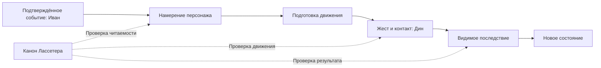

# Канон анимации alashi по Лассетеру

Решение Амира от 10.10.2026: принципы John Lasseter являются обязательной основой анимации alashi. Иван и Дин опираются на этот документ при подготовке сцен и их приёмке. Статус target относится к требованиям ниже, а не к утверждению, что все сцены уже им соответствуют.

Источник: John Lasseter, *Principles of Traditional Animation Applied to 3D Computer Animation*, SIGGRAPH, 1987. [Полный текст статьи](https://cgvr.cs.uni-bremen.de/teaching/cg_literatur/Principles%20of%20traditional%20animation%20applied%20to%203D%20computer%20animation.pdf). source_defined: статья рассматривает 11 принципов; Personality объясняет их совместную работу. Автор опирается на традицию Disney. Критерии alashi в таблице являются применением статьи к нашему проекту.

## Общая карта

Зритель должен понять, что персонаж собирается сделать, увидеть действие и его результат. Перед реализацией фиксируется визуальная цель. Ключевые кадры реализации сравниваются с ней; референс обозначается как концепт до реализации сцены.

## Как применять принципы

| Принцип статьи | Критерий для alashi |
| --- | --- |
| Squash and stretch | Вес и усилие читаются в позе. Жёсткий корпус Degenie сохраняет форму; руки и дым могут менять силуэт. Масштабирование корпуса требует отдельного художественного основания. |
| Timing | Длительность зависит от усилия и смысла действия. Контакт, перенос веса и осознание результата получают время, в которое их можно прочесть. |
| Anticipation | Перед главным движением есть подготовка. Взгляд направляется к предмету раньше, чем корпус и руки начинают действие. |
| Staging | В каждый момент понятно главное действие и его адресат. Лицо, контакт ладоней и результат не перекрываются интерфейсом или эффектами. Силуэт читается в размере телефонного экрана. |
| Follow through and overlapping action | После остановки основного движения вторичные части догоняют его. При ловле ящика корпус принимает вес, затем руки и дым успокаиваются. |
| Straight ahead action and pose to pose | Для действий с предметами сначала задаются смысловые позы и контакты. Между ними строится движение; процедурные детали не заменяют ключевые позы. |
| Slow in and out | Ускорение и торможение соответствуют усилию. Не каждый промежуточный ключ требует полной остановки; непрерывный перенос предмета сохраняет связность. |
| Arcs | Траектории рук и предметов читаются как движение через пространство. Дуга не должна нарушать контакт, менять длину костей или проводить предмет через персонажа. |
| Secondary action | Мимика и дым поддерживают главное действие. Вспышки не отвлекают от момента контакта или результата. Это же требование применяется к фону. |
| Exaggeration | Усилие усиливается настолько, чтобы быть видимым в кадре. Преувеличение сохраняет характер и причинность действия. |
| Appeal | Выразительная поза и ясная композиция делают персонажа читаемым. Пластика покупки отличается от взятки. У победы собственный силуэт; один жест не заменяет все реакции. |

Personality связывает движение с тем, что персонаж думает и чувствует. Для Degenie это означает последовательность внимания и реакции: он замечает предмет, действует, затем воспринимает результат. Постоянное движение само по себе не показывает мысль.

## Ответственность команды

Иван обеспечивает подтверждённые события с устойчивыми идентификаторами и доступными полями результата. Принятая команда, подтверждённое игровое действие и подтверждённая транзакция Solana сохраняют свои значения. Если источник не передаёт количество товара или затраты, визуальная сцена не придумывает числа. Повторная доставка события не создаёт вторую покупку.

Дин переводит событие в позы и траектории. Начало движения показывает намерение, контакт объясняет физику, завершение показывает последствие. Квитанция использует данные того же события. Последний баланс не выдаётся за баланс в историческом кадре повтора. В режиме reduced motion смысл и данные результата сохраняются.

## Приёмка изменения

- В PR указать изменённое действие, применённые принципы и визуальный референс.
- Приложить ключевые кадры или запись: подготовка, контакт, последствие. При просмотре без подписей предмет и адресат действия должны быть понятны. Проверку понимания новым зрителем отмечать отдельно от авторского просмотра.
- Проверить сцену в размере телефона. Ладони поддерживают предмет; интерфейс не закрывает лицо и контакт.
- Проверить паузу, повторный запуск и перемотку назад. Поза не накапливает смещение; контакт не зависит от частоты кадров.
- Проверить reduced motion и отсутствие количественных данных. Результат остаётся доступным, выдуманные суммы не появляются.
- Для подтверждённых действий проверить источник данных, повторную доставку и переход к следующему событию. Для демо и исторического повтора сохранить явные подписи режима.

Если принцип неприменим к конкретной сцене или от него намеренно отступили, в PR записать причину и показать результат. Каждый принцип проверяется по задаче сцены; добавлять декоративное движение ради отметки в таблице не требуется.

## Первый участок: покупка

Цель текущей доработки: взгляд на ящик опережает корпус; обе ладони принимают его, корпус оседает под весом и стабилизируется; после контакта показывается изменение товара и затрат из события. Если событие не содержит чисел, показывается только факт покупки с обозначением источника. Эффект подтверждения подчинён этому результату.

target: изображение является концептом поз и последовательности. Материалы и детализация исходного Degenie служат референсом персонажа; оно не подтверждает качество реализации. В сцене сохраняются текущая модель и студия.

Промпт референса: четыре кадра покупки Degenie с сохранением персонажа из assets/readme-degenie.png. Взгляд на ящик до поворота корпуса; оплата одной монетой; контакт обеих ладоней с ящиком и оседание корпуса под весом; устойчивое удержание с тихой квитанцией GOODS + / CASH -, без придуманных чисел. Жёсткий корпус не деформируется. Дым противодействует наклону. Лицо и контакт не перекрываются, композиция читается на лавандовой студийной площадке.

### Проверка первого применения

[Исходное ревью](../ops/ANIMATION_REVIEW_20261010.md) относится к main 485e8ba до этой доработки.

observed: локальный кадр `/live`, 3,8 секунды, ширина окна 390 пикселей. Числа в квитанции являются явно подписанными примерами демо.

source_defined: в ончейн-просмотре суммы берутся из события goods_bought. HTTP-поток без количественных полей показывает Goods received / Cost unavailable. Эти ветви проверены по контракту и тестами данных; живые покупки для проверки не совершались.

observed: сборка frontend, check:purchase, devnet-viewer-check.ts и live-api-check.ts прошли. Просмотрены ключевые позы и перемотка назад; ошибок браузера нет. Reduced motion проверен в профиле движения и по коду компонента, без переключения системной настройки. Пользовательский тест понимания новым зрителем не выполнялся. Публикация на живом сайте в эту проверку не входит.
