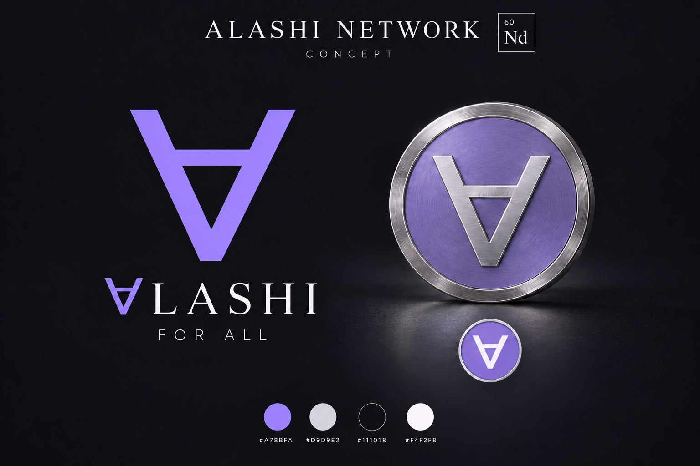

# Монета Alashi по выбранному концепту

source_defined: поручение Амира от 10.10.2026. Основа: ТЗ для Дина
ALASHI_FOR_ALL_BRIEF_FOR_DIN_2026-10-10, раздел «Логотип и монета»;
передача ALASHI-FORALL-BRAND-20261010-01, docs 014711da.
Контрольная сумма выбранного PNG:
9e1236c09306433fadb841dd78e8b45bb95e30fc6b178d89c014eb1bcf5dfcde.

source_defined: серебристый обод и выступающий ∀ цвета #D9D9E2;
лиловое поле #A78BFA с лёгкой фактурой. Знак строится по выбранному
контуру, а не берётся из шрифта. Nd и 60 остаются пояснением концепта.
Мелкая надпись по окружности и золотой вариант не входят в поручение.
Форма обода, дополнительные детали и новый ракурс требуют решения Амира.

## Реализация

observed: [общая фабрика монеты](../../frontend/src/brand/coin.ts) используется
в торговых сценах BUY/SELL и оплате Mule. Обод стал плоским кольцом с короткой фаской. Лиловое поле
слегка утоплено; ∀ выступает над ним с обеих сторон. Тонкая круговая фактура
формируется локально и фильтруется mipmaps. Контур из geometry.ts сохраняется.
Размеры укладываются в прежний объём контакта; траектории и время действий
не изменены. Модель GLB и материалы персонажа не переписываются.

observed: это кадр реализации, а не новый концепт. Он снят из локальной
[сцены проверки](../../frontend/art/brand-coin-review.html), которая использует
ту же фабрику. Ракурс близок к исходному концепту; источники света подбирались
для читаемости серебряного рельефа и сохранения лилового тона. Плоские SVG
и прозрачные PNG 32/64/128/256/512/1024 сохраняют точные коды палитры.

## Проверка по Лассетеру

Намерение персонажа и ключевые позы сохраняются: BUY оплачивает товар,
SELL принимает оплату, Mule передаёт оплату курьеру. Проверены монета над
ладонью и её читаемость в этих позах. Это правка реквизита; новых движений нет.
Действует [обязательный канон анимации](../200_ZETTEL/20261010-lasseter-animation-canon.md).

| Принцип | Применение к этой правке |
| --- | --- |
| Squash and stretch | Жёсткая монета сохраняет форму. Усилие персонажа и приём веса не меняются. |
| Timing | Длительности действий и моменты оплаты сохранены. |
| Anticipation | Взгляд и подготовка руки перед обменом сохранены. |
| Staging | Лиловое поле и серебристый ∀ читаются отдельно от ладони и реквизита. |
| Follow through and overlapping action | Существующая реакция корпуса и дыма сохраняется. |
| Straight ahead action and pose to pose | Проверены позы оплаты BUY 1,35 с, получения SELL 3,8 с и оплаты Mule 1,9 с. |
| Slow in and out | Профили ускорения и торможения остаются прежними. |
| Arcs | Дуги передачи и объём контакта сохраняются. |
| Secondary action | Новых эффектов нет; mipmaps сглаживают мелкую фактуру при уменьшении. |
| Exaggeration | Размер монеты не увеличивается для подчёркивания оплаты. |
| Appeal | Монета следует выбранному фирменному символу и палитре. |

Personality: монета остаётся реквизитом намеренного обмена. Она не добавляет
эмоцию, игровую валюту или подтверждение транзакции. Источник квитанции прежний.

## Визуальные кадры

observed: локальное собранное демо /live, ширина окна 390 CSS px.
Страницы не имеют горизонтального переполнения. Проверены пауза и перемотка;
Mule проигран полностью и вернулся к ожиданию. Ошибок браузера не было.

observed: сборка и общий набор check:animations прошли. После окончательного
увеличения рельефа отдельно повторены проверка монеты и 5196 кадров сценариев.
Кандидатов пересечения руки с реквизитом нет. Проверка монеты подтверждает
палитру, обе стороны ∀, открытый просвет и прежний объём контакта. Проверены
независимость экземпляров, fade и освобождение текстуры. Проверка типов сцены
рендера и теста прошла; lint изменённых исходников не нашёл ошибок.

| Поза | Кадр |
| --- | --- |
| BUY, оплата 1,35 с | [Кадр телефона](../assets/coin-20261010/buy-phone.jpg) |
| SELL, получение оплаты 3,8 с | [Кадр телефона](../assets/coin-20261010/sell-phone.jpg) |
| Mule, оплата 1,9 с | [Кадр телефона](../assets/coin-20261010/mule-phone.jpg) |

not_validated: понимание новым зрителем, скорость на физическом телефоне
и переключение системной настройки reduced motion. Публикация сайта
не выполнялась. Численные проверки reduced motion входят в существующий набор.
